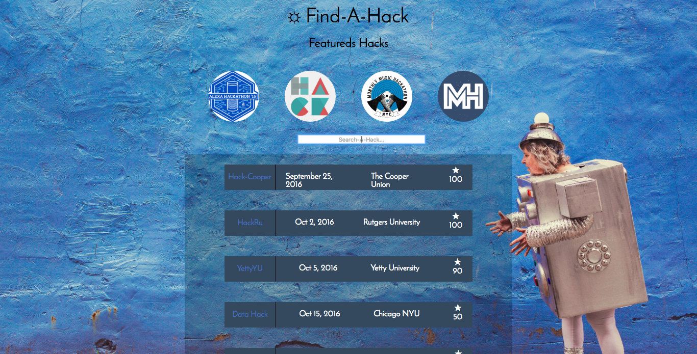

# Find-A-Hack (Hack Cooper)
In order to spread the tradition of Hackathons and promote innovation we designed a web application that web scrapes the internet for 
hackathons with as much accuracy as possible. The goal is to make one platform to find all hackathon info/events without having to jump
back and forth from different resources and possible miss some really good hacks.

# Features
Uses Geocoding from Google API's to use the users current location to only display hackathons that are nearby. We also have a feature that
allows the user to choose the max distance from hackathons to display.

# Backend 
We web scraped Twitter for key words where "hackathon" was used we took names of possible hackathons and ran it through a verification process.
Our verification process consisted of running a few google searches and based on the occurency and consistency of the hits our search made would
give us a better probability of what was a valid hackathon and what wasn't. Based on the probability a list of hackathons is sent 
to the front end. Additionally the popularity rating of a hackathon is based on the hits it had before being verified both on twitter and
in Google searchs. 

# Problems/Issues
Our system works fairly well, but in order for this system to work well many requests need to be made. Google and Twitter (as wel as many other
valuable sources) have rate limits and we can not freely scrape without being resorted to paying for these queries. Our quick fix was
trying to use AWS Lambda to generate fake IP-Addresses over a span of time so that we could fool the API's into to giving us more 
requests/queries... This albeit clever still did not solve the problem fully. 

# Overall
We believe that this web could be very usefull for kids, students, and adults. Especially those new to the field who are may be 
less inclined to search for these opportunities. By providing a platform that removes the need to visit other sites we can push innovation 
and remove some of the stress that comes with keeping up with upcoming hackathons.

# API's/Tools
- Google Geocoding API
- Google Custom Search API
- AWS Lambda
